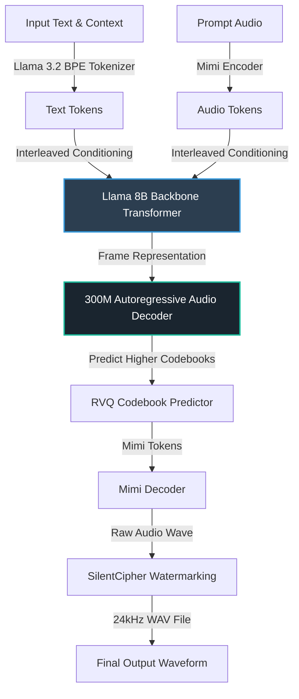

# Technical Explainer: MisoTTS 8B Architecture & Capabilities

This document provides an exhaustive technical analysis of the **MisoTTS 8B** model, its multi-stage neural architecture, native capabilities, speaker conditioning format, and phonetic handling.

---

## 1. High-Level Model Overview

**MisoTTS 8B** is an state-of-the-art **8.2 Billion parameter Text-to-Dialogue RVQ (Residual Vector Quantization) Transformer** engineered by Miso Labs. Unlike traditional single-sentence text-to-speech (TTS) engines, MisoTTS is natively designed to model and synthesize multi-turn human conversations with natural prosody, stylistic transitions, turn-taking cues, and emotional nuance.

### Key Performance Attributes
* **Parameters:** ~8.2 Billion (combined Backbone + Audio Decoder + Embeddings).
* **Sample Rate:** 24 kHz high-fidelity mono audio.
* **Temporal Compression:** 12.5 Hz audio frame rate (80ms per frame).
* **Quantization:** 32 Residual Vector Quantization (RVQ) codebooks.
* **Context Window:** 2,048 tokens (text and audio interleaved).

---

## 2. Core Capabilities & Input Formats

### A. Contextual Multi-Turn Dialogue
Traditional TTS engines generate speech in isolation, leading to robotic, fragmented, and stylistically disjointed segments in a dialogue. MisoTTS solves this by maintaining a running list of `Segment` structs (comprising the speaker ID, text transcript, and raw synthesized audio) as *prior context*. 

The preceding text and audio tokens are fed directly into the transformer's active history, allowing the model to naturally adapt its tone, tempo, and response timing to match the conversational flow (e.g., matching a speaker's excitement, whispering, or pausing appropriately after a question).

### B. Speaker Conditioning (Simple & Infinite)
A standout feature of MisoTTS is its elegant speaker conditioning mechanism. In `generator.py`, we observe that speaker identity is not injected via complex speaker embedding vectors or external matrices. Instead, it is done via **plain-text prefixing**:

```python
formatted_text = f"[{speaker}] {text.lstrip()}"
# Example: "[0] Oh, definitely. I think Apple Silicon is a game-changer!"
```

The model's extensive pre-training on dialogue corpuses allows it to interpret these bracketed numerical prefixes (`[0]`, `[1]`, `[2]`, etc.) as structural tokens that trigger internal attention weights, re-routing the acoustic properties to specific pre-trained speaker styles. This provides:
1. **Infinite Variations:** Synthesizing speech with a wide range of pre-tuned speaker profiles.
2. **Simplified Interface:** No need to handle multi-megabyte speaker latent vectors.

### C. Prompted Voice Cloning (Zero-Shot)
MisoTTS supports high-fidelity zero-shot voice cloning. By passing an optional reference audio clip (ideally 3 to 10 seconds of clean, noise-free speech) along with its *exact* textual transcript, you can clone any voice:
1. The reference audio is encoded into its Mimi audio tokens.
2. The exact transcript is tokenized into text tokens.
3. These are interleaved and prepended to the synthesis prompt as context.
4. The transformer backbone matches the acoustic properties of the audio prefix to the subsequent text tokens, generating speech that perfectly mimics the speaker's vocal timber, pitch range, and accent.

---

## 3. Phonetic Handling: IPA and X-SAMPA Support

A common inquiry is whether MisoTTS natively accepts phonetic representations like **IPA (International Phonetic Alphabet)** or **X-SAMPA** as direct text inputs.

Based on our architectural deep-dive:

> [!IMPORTANT]
> **MisoTTS is primarily an orthographic-text-based model and does NOT natively use or require a Grapheme-to-Phoneme (G2P) pre-processing step.**

### How Text is Processed
MisoTTS uses the standard, unmodified **`meta-llama/Llama-3.2-1B` BPE (Byte-Pair Encoding) Tokenizer** with its standard 128,256 vocabulary.

1. **Orthographic Preference:** The Llama tokenizer expects standard English orthographic text (e.g., `"Hello world"`). The model's 8B parameter backbone handles the mapping from English spelling to phonetic pronunciations implicitly based on its massive pre-training data.
2. **IPA / X-SAMPA Input Behavior:**
   * **IPA Symbols:** Many individual IPA Unicode characters (like `ə`, `ʃ`, `θ`) are present in Llama 3's 128k vocabulary (as individual bytes or character tokens). However, because the MisoTTS model was trained almost exclusively on English orthography paired with audio, inputting pure IPA phonetic strings (e.g., `[həˈloʊ]`) will result in unexpected token combinations. The model will try to read them literally or segment them into rare subwords, leading to highly degraded, unnatural, or completely silent audio outputs.
   * **X-SAMPA Strings:** Since X-SAMPA translates IPA into 7-bit ASCII characters (e.g., `h@'loU`), entering X-SAMPA will cause the tokenizer to see standard letters and punctuation in strange, non-English sequences. The backbone will attempt to pronounce the ASCII letters literally (e.g., saying "h-at-l-o-u"), resulting in nonsensical vocalizations.

### Best Practices for Custom Pronunciations
If the model mispronounces a rare word, acronym, or foreign name, you should use **orthographic approximation (sounds-like spelling)** instead of IPA or X-SAMPA:
* **Instead of IPA:** `[mæk ˌɛm ˈɛl ˌɛks]`
* **Instead of X-SAMPA:** `m{k %Em %El %Eks`
* **Use Orthographic Sounds-Like:** `"Mac M-L-X"` or `"Mac Em El Ex"`

---

## 4. Technical Architecture: The Three Neural Stages

MisoTTS is modeled as an autoregressive audio generation pipeline consisting of three core neural network stages:



### Stage 1: The Audio Tokenizer (Mimi Codec)
Developed by Kyutai Labs, **Mimi** is a state-of-the-art neural audio codec. It compresses high-fidelity 24 kHz audio down into 32 Residual Vector Quantization (RVQ) codebook channels at a temporal resolution of **12.5 Hz (frames per second)**. 
* Each frame spans **80ms of audio** (1,920 audio samples compressed into 32 tokens).
* This extreme compression matches the semantic density of text tokens (~12-15 words per second), allowing text and audio to be modeled on a unified timeline.

### Stage 2: The Backbone Transformer (Llama 8B)
The core of MisoTTS is a large transformer backbone structurally identical to Meta's **Llama 3.2 8B**. It processes interleaved sequences of:
* Standard text tokens (projected via a 128k embedding layer).
* Core audio frame embeddings (calculated by summing the embeddings of the 32 RVQ codebooks).

The Backbone processes the conversation history and outputs a dense **frame representation** for the current step, capturing the combined semantic, prosodic, and contextual state of the conversation.

### Stage 3: The Autoregressive Audio Decoder (Llama 300M)
The dense representation from the Backbone is projected into a smaller, highly-efficient **300M parameter Llama transformer decoder**. 
* The decoder's job is to predict the remaining 31 higher-order codebooks for the current frame step-by-step.
* It utilizes a lightweight attention cache to run 31 micro-steps of autoregressive generation *per audio frame*.
* Once all 32 codebooks are predicted, the frame is complete, and the codes are passed to the Mimi Decoder to produce high-fidelity raw audio.

---

## 5. macOS & Apple Silicon Suitability

### The PyTorch Bottleneck
On standard macOS installs, running the PyTorch code in `sources/MisoTTS/run_misotts.py` forces the model to run on the **CPU** rather than the GPU (Metal Performance Shaders / MPS). This is because the underlying model architecture contains certain operations with **float64** data types, which are not currently supported by Apple's MPS backend.
* Running an 8.2B parameter model on CPU leads to severe latency (~1-2 seconds of processing per second of speech).
* This makes interactive dialogue, voice agents, or streaming completely unusable.

### The MLX Native Advantage
By migrating to **MLX** (Apple's native machine learning framework), we bypass these limitations completely:
1. **Full GPU Acceleration:** MLX runs natively on the Apple Silicon GPU using unified memory, eliminating the float64 issues of PyTorch.
2. **Unified Memory Architecture:** MLX utilizes Apple Silicon's shared memory layout, allowing the 8.2B model weights to reside in memory without expensive PCIe transfers, delivering speeds of over **20+ frames per second** (more than 1.5x real-time generation speed).
3. **Rust-backed Mimi Integration:** By using `moshi_mlx` and `rustymimi`, the audio tokenizer runs as an ultra-fast, pre-compiled Rust binary, providing instant audio encoding/decoding.
