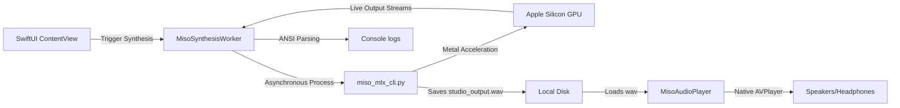

# 🎙️ MisoTTS Studio (macOS Desktop)

Welcome to **MisoTTS Studio**, a premium, state-of-the-art macOS SwiftUI application engineered specifically for real-time speech synthesis and zero-shot voice cloning. This desktop application brings native **Metal-accelerated GPU inference** on Apple Silicon to a beautiful, highly interactive, and HIG-compliant desktop workspace.

Under the hood, the application acts as a high-performance frontend for the local MLX-adapted **MisoTTS 8B** model, communicating with the backend Python runtime over low-overhead processes while displaying rich telemetry and native audio playbacks.


## ✨ Key Features

*   **⚡ Local Metal GPU Inference**: Synthesize high-fidelity 24 kHz speech using Apple Silicon’s unified memory architecture.
*   **🎭 Flexible Speaker Conditioning**: Fast preset selection for speaker IDs `0` through `30` via plain-text prefixing, supporting multi-speaker inline dialog prefixes.
*   **👤 Zero-Shot Voice Cloning**: Simple paths to drag, browse, or reference a 3–10s WAV voice snippet and its transcript to clone any voice on-the-fly.
*   **🎛️ Real-Time Parameter Tuning**: Interactive, fluid sliders for:
    *   *Start & Minimum Sampling Temperatures*
    *   *Temperature Decay Step Rates* (to eliminate accumulation of sibilance)
    *   *Classifier-Free Guidance (CFG)* (to enforce alignment)
    *   *Max Audio Duration* (safety generation cap up to 60.0s)
*   **📊 Live Monospace Console**: Direct telemetry pipelines print live compilation, backbone forward loops, and step progress indicators step-by-step.
*   **🧬 GPU Telemetry Analytics**: Post-synthesis telemetry displays:
    *   *Real-Time Factor (RTF)* (faster-vs-slower than real-time generation factor)
    *   *Inference Speed* (active backbone steps per second)
    *   *Warmup & Compilation Latency*
    *   *Peak RAM Memory Allocation* (demonstrates the 10GB RAM saving using 4-bit INT4 quantization)
*   **⏱️ Speaking Duration Heuristic Warning**: Interactive word-count analyzer calculates expected speaking time in real-time. If estimated speaking duration exceeds the Max Audio Duration safety ceiling, it reactively transitions into an amber warning block to prevent mid-word cutoff.
*   **🎵 Integrated Audio Card**: Scrub, seek, adjust volume, and play back synthesized results directly inside the application, complete with playback rate controls (0.5x to 2.0x).

---

## 🛠️ Application Architecture

The application is structured around a decoupled, thread-safe asynchronous pipeline:



### Core Components
1.  **`ContentView.swift`**: The main user interface, incorporating responsive layouts, custom slider containers, state management, and the interactive timing heuristic analyzer.
2.  **`MisoSynthesisWorker.swift`**: The background controller that initializes and manages the sub-process pipeline, parses standard error streams into clean ANSI progress outputs, and decodes generation telemetry JSON.
3.  **`MisoAudioPlayer.swift`**: Native AVFoundation playback engine for seeking, progress scrubbing, volume adjustments, and rate modulation.
4.  **`HIGExtensions.swift`**: Provides curated components, buttons, and animations matching Apple's Human Interface Guidelines.

---

## 🚀 Building & Running

MisoTTS Studio is modeled as a native **Swift Package Manager (SPM)** executable.

### Prerequisites
*   A Mac with **Apple Silicon** (M1/M2/M3/M4, Pro, Max, or Ultra).
*   **Xcode 15+** or **Swift 5.9+** toolchain.
*   The project Python virtual environment synchronized with the core CLI (`make setup`).

### Command-Line Execution
Run these commands from the root of the `misotts` repository:

1.  **Compile & Launch the App Natively**:
    ```bash
    make run-studio
    ```
2.  **Compile Only (Debug)**:
    ```bash
    make build-studio
    ```

---

## 📦 Standalone macOS Bundling

You can package MisoTTS Studio into a native, standalone, and completely portable **`.app` bundle** that can be moved into your `/Applications` directory or launched via Spotlight Search.

Run the following command from the repository root:
```bash
make bundle-studio
```

This automates the following actions:
1.  Compiles the Swift package in high-performance **Release mode** (`-c release`).
2.  Generates the standard directory structure: `outputs/MisoTTS Studio.app/Contents/MacOS/`.
3.  Draws a high-res glowing waveforms logo and compiles it into a native Apple macOS `.icns` squircle app icon.
4.  Injects a production-ready `Info.plist` to manage OS focus states and bundle identifier parameters.

The resulting app will be located at:
📍 `outputs/MisoTTS Studio.app`

---

## 🧪 The Speaking Duration Heuristic

MisoTTS generates audio autoregressively step-by-step. To protect against runaway loops, a safety duration ceiling is enforced. To help you match text scripts to appropriate safety caps, the Studio uses this human conversational speed formula:

$$\text{Estimated Speaking Duration (seconds)} \approx \frac{\text{Word Count}}{2.2} + 2.0\text{ seconds padding}$$

If you write a script whose estimated speaking time exceeds your active **Max Audio Duration Slider**, the text panel displays a dynamic alert:

> [!WARNING]
> **Warning: Exceeds slider limit. Speech will cut off mid-word!**
> If this badge appears, simply drag the safety slider to the right to accommodate the script length.
